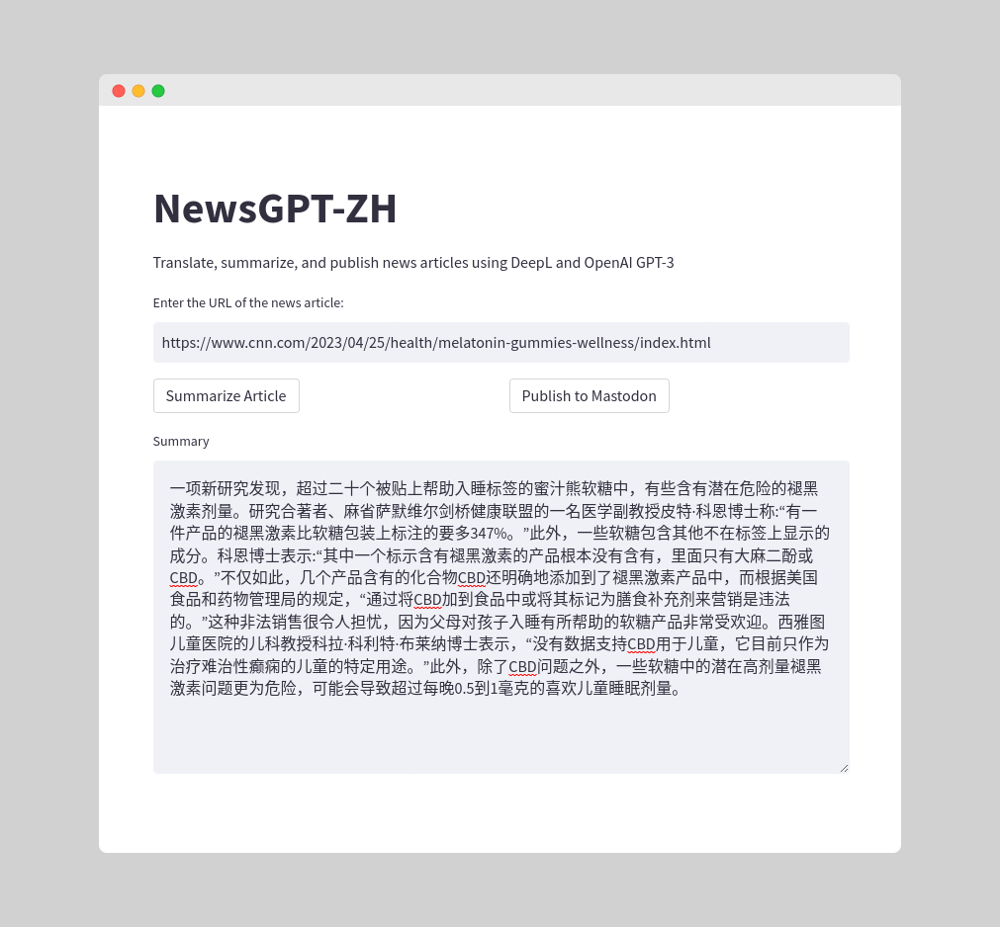

# NewsGPT-ZH
 Translate, summarize, and publish news briefs using DeepL and OpenAI GPT-3



## Installation

1. Clone this repository

2. Install the requirements: `pip install -r requirements.txt`

3. Create a `.env` file with the following variables:

```
DEEPL_API_KEY=your_deepl_api_key
OPENAI_API_KEY=your_openai_api_key
MASTODON_API_URL=your_mastodon_api_url_optional
MASTODON_API_KEY=your_mastodon_api_key_optional
```

4. Run the Streamlit app: `streamlit run app.py` and open the URL in your browser
